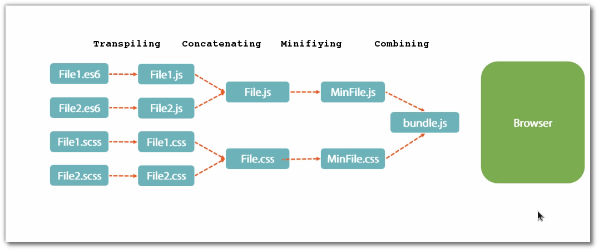

# webpack-notes
simple webpack notes.

## TOC

- Need of webpack(#need_of_webpack)

## Need of Webpack

Webpack is an optimized advanced task runner that is used to process input file into output files.

The process involves below steps:

*Transpilation + Concatenation + Minification + Combine CSS into JS (Extra-feature that other task runners dont have)*

**Note:** Webpack use NPM not Bower.
